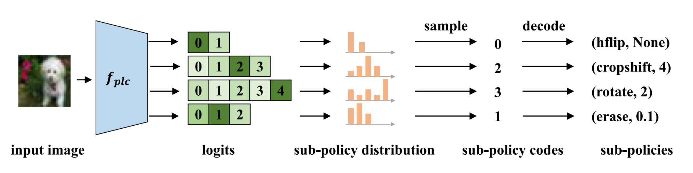
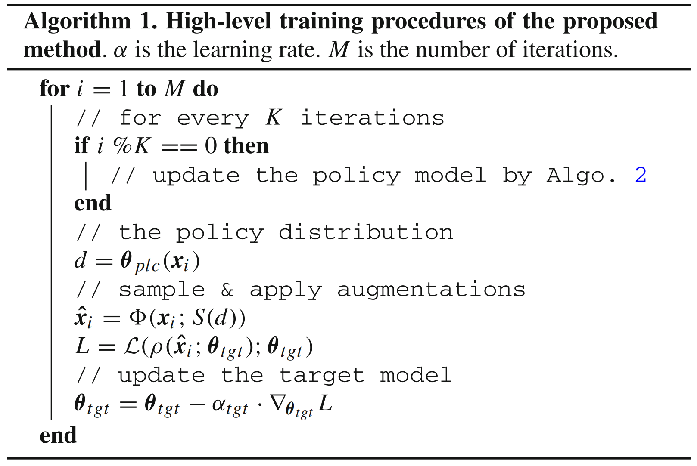
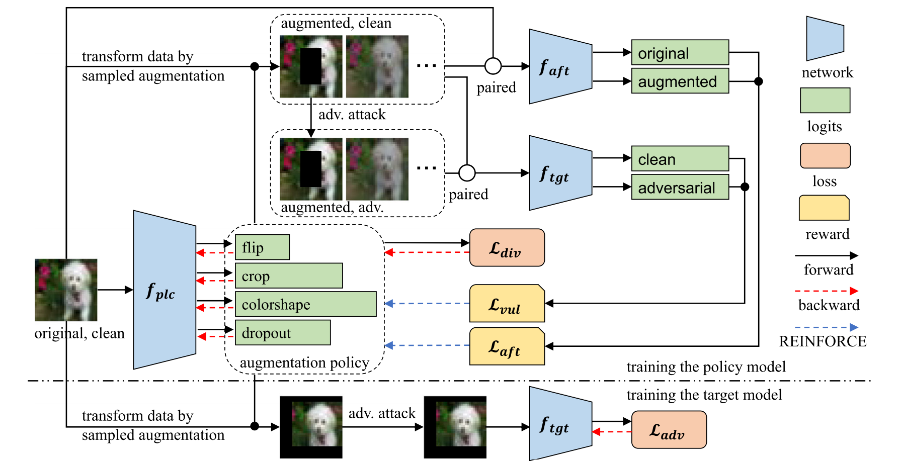
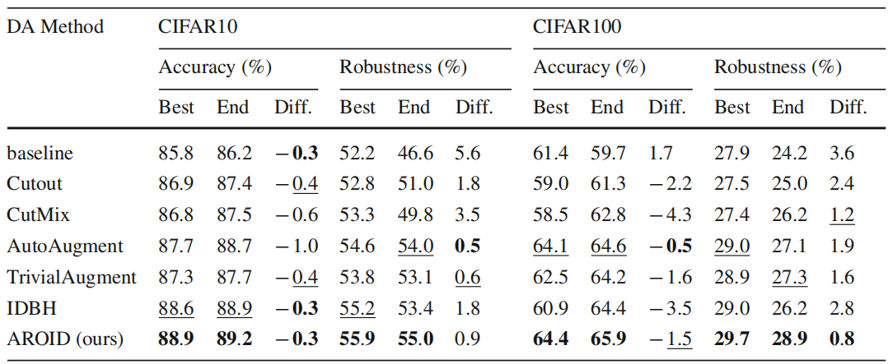

# AROID：提高对抗鲁棒性的在线实例级数据增强方法

<small>李政翱 · 周论文阅读 · 17th Mar</small>

> **论文来源**
>
> 此论文收录于 IJCV 2025，原文为 [AROID: Improving Adversarial Robustness Through Online Instance-Wise Data Augmentation](https://doi.org/10.1007/s11263-024-02206-4)

## 摘要

深度神经网络容易受到样本的影响。对抗训练（AT）是针对对抗样本的有效防御方法。然而，对抗训练容易出现过拟合，从而大大降低鲁棒性。

如果针对对抗训练进行适当设计和优化，最近的研究表明数据增强（DA）可以有效减轻鲁棒过拟合。本文提出了一种**自动**、**在线**、**实例级数据增强**策略的新方法，以提高对抗训练的稳健泛化。这是第一个专门针对稳定性的自动化数据增强方法。提出了一个由**脆弱性**、**亲和力**和**多样性**组成的新颖的策略学习目标，并被证明足够有效和高效，可用于在对抗训练期间自动生成数据增强。

实验表明，本文方法将策略搜索的成本从 AutoAugment 的 5000 小时和 IDBH 的 412 小时降低到 9 小时，使自动化数据增强更实用地用于对抗性鲁棒性。这使我们的方法能够有效地探索大型搜索空间以获得更有效的数据增强策略，并随着训练的进行而发展策略。本文方法在各种模型架构和数据集中都优于所有竞争性的数据增强方法。我们的数据增强策略强化了传统对抗训练，使其在准确性和鲁棒性方面超过了几种最先进的对抗训练方法。它还可以与那些先进的对抗训练方法相结合，以进一步提高鲁棒性。

## 数据增强策略建模

本文的数据增强由四种类型的变换组成：**翻转**、**裁剪**、**颜色/形状变换**和**丢弃**。具体实现如下：

- **翻转**（Flip）
  水平翻转（Horizontal Flip）

- **裁剪**（Crop）
  裁剪平移（Cropshift）

- **丢弃**（Dropout）
  擦除（Erasing）

- **颜色/形状变换**（Color/Shape）
  颜色、锐度、亮度、对比度等。

如上方法的关系可由右图表示。

## 策略模型
为了给每个输入实例单独定制数据增强方法，引入了如下的**策略模型**（Policy Model）：

该策略模型采用 DNN 骨干从数据中提取特征，并在提取特征的基础上使用多个并行的线性预测头来预测策略。一个预测头的输出被转换为一个多项式分布，其中每个 logit 代表一个预定义的子策略，也即一个与强度/大小相关联的增强操作（例如，`ShearX, 0.1`）。

## 数据增强策略目标

策略模型使用三个目标作为指导：（对抗）**脆弱性**、**亲和性**和**多样性**。

直观地说，增强数据增强的多样性和强度应该有助于通过增加训练数据的复杂性来减轻鲁棒过拟合。增加对抗样本强度增加了模型学习的难度，从而减少鲁棒过拟合。

然而，如果强度超过了训练模型可以拟合的水平，精度甚至鲁棒性都会下降，尽管鲁棒过拟合现象减轻了。因此，为了最大限度地提高性能，应该仔细调整强度，以在减少鲁棒过拟合和提高整体性能之间取得平衡。

## 数据增强目标 I：脆弱性

脆弱性是在目标（分类）模型下，增强样本的对抗样本的损失值减去增强样本的损失值。形式化表示为：

$$
\begin{aligned}
    \mathcal L_{vul}(\mathbf x; \mathbf \theta_{plc})&=\mathcal L(\rho(\mathbf{\hat x}; \mathbf \theta_{tgt}); \mathbf \theta_{tgt})-\mathcal L(\mathbf{\hat x}; \mathbf \theta_{tgt}) \\

    \text{where}\ \mathbf{\hat x} &= \Phi (\mathbf x; S(\mathbf \theta_{plc}(\mathbf x)))
\end{aligned}
$$

其中，$S(\mathbf \theta_{plc}(\mathbf x))$ 表示由模型特征预测的**数据增强策略**，而 $\Phi (\mathbf x; S(\mathbf \theta_{plc}(\mathbf x)))$ 则表示按照定制的增强策略而**增强后的样本**（也即 $\mathbf{\hat x}$）。

脆弱性数值越大表示在数据增强后 $\mathbf x$ 越容易受到对抗性攻击。关于训练数据和鲁棒性之间关系的一个普遍观点是，**对抗训练受益于强对抗样本**。从几何的角度来看，最大化脆弱性**鼓励策略模型将数据投射到以前不那么完善的空间中**。

## 数据增强目标 I：脆弱性

策略模型需要使得增强样本与原样本的分布平移在一定范围内，以防止超出模型的拟合能力，也即：

$$
\mathop{arg}\max_{\mathbf \theta_{plc}} \mathcal L_{vul}(\mathbf x; \mathbf \theta_{plc})\quad \text{s.t.} \mathop{ds}(\mathbf x, \mathbf{\hat x}) \le D
$$

其中 $\mathop{ds}(\cdot)$ 是对于**分布平移**（distribution shift）的度量，$D$ 是常数。可以通过添加罚项将此有约束优化问题转化为无约束优化问题如下：

$$
\mathop{arg}\max_{\mathbf \theta_{plc}} \mathcal L_{vul}(\mathbf x; \mathbf \theta_{plc})-\lambda\cdot\mathop{ds}(\mathbf x, \mathbf{\hat x})
$$

其中 $\lambda$ 是超参数，$\lambda$ 越大原式中的 $D$ 越小，也即对于分布平移的约束越严格。

## 数据增强目标 II：亲和力

上式中的分布平移由如下的**亲和力**公式度量：

$$
\mathop{ds}(\mathbf x, \mathbf{\hat x}) = \mathcal L_{aft}(\mathbf x; \mathbf \theta_{plc}) = \mathcal L(\mathbf{\hat x}; \mathbf \theta_{aft}) - \mathcal L(\mathbf x; \mathbf \theta_{aft})
$$

其中 $\mathbf \theta_{aft}$ 为**亲和力模型**，也即在原数据上预训练的分类模型。亲和力模型在对抗样本上和原样本上的损失差值即为分布平移量。亲和度随着对抗强度的增加而增加，也即亲和力模型更难正确分类该样本。

通过代换 $\mathop{ds}(\cdot)$，可得到如下公式：

$$
\mathcal L_{hrd}(\mathbf x; \mathbf \theta_{plc}) = \mathcal L_{vul}(\mathbf x; \mathbf \theta_{plc}) - \lambda \cdot \mathcal L_{aft}(\mathbf x; \mathbf \theta_{plc})
$$

对抗样本的**强度**即为脆弱性减去由常数 $\lambda$ 约束的分布平移量。这个公式实际上在鼓励策略模型在不损害模型准确性的条件下增强对抗样本的效果，从而使得对抗训练更有效。

## 数据增强目标 III：多样性

多样性在策略模型的对数上强制执行了一个宽松的均匀分布，本质上是不希望某些方法概率过小或过大，比如一直用或从来不用 `flip` 来增强数据。

$$
\mathcal L^h_{div}(\mathbf x) = \frac{1}{C} \left[ -\sum^{p_i^h<l}_{i}\log(p_i^h)+\sum^{p_j^h>u}_{j}\log(p_j^h)\right]
$$

直观地说，多样性损失会惩罚过小和过大的概率，有助于将分布限制在一个预定义的范围 `(l,u)` 内。结合三个增强目标，容易得出总公式如下：

$$
\mathop{arg}\max_{\mathbf \theta_{plc}} -\mathbb E_{i\in B}\mathcal L_{hrd}(\mathbf x_i)+\beta \cdot \mathbb E_{h\in H}\mathcal L^h_{div}(\mathbf x; \mathbf \theta_{plc})
$$

## 机理

脆弱性目标是通过对来自目标模型的对抗扰动引起的损失的变化来计算的。策略模型从这些反馈中学习，以确定哪些类型和规模的数据增强提高了增强数据的对抗性脆弱性。这种学习**增加了对训练数据应用这种增强方法的可能性，从而增加对抗强度**。

同时，亲和力目标将数据增强的**强度限制在一个不影响分类性能的水平**。

此外，多样性目标**防止了对特定数据增强方法的过度依赖**，促进了对不同增强技术的探索。

这三个目标共同决定了每个训练样本的适当增强方法。

## 整体流程图例

    

## 实验

<small>本文提出的 AROID 方法超越了所有的 SOTA 方法。</small>

## 心得

此篇论文对于模型的应用非常新颖：通过训练一个策略模型，将图像提取的特征映射到具体的数据增强**动作**，来为每个样本自动进行数据增强。

这种应用模型的方法也常见于游戏 AI，其通过增强学习（RL）将当前时刻的游戏状态映射到一组**动作**（角色移动、攻击等）。可见，对于模型的灵活运用也是一大重点。

最后，在现有模型结构确定后，还需要仔细考虑**损失函数的表示**。如果损失函数**不可微**（如本文中的图像增强操作是不可微的），则需要通过其他的公式来估计该步骤的损失，从而能够利用人工智能框架来自动优化模型。