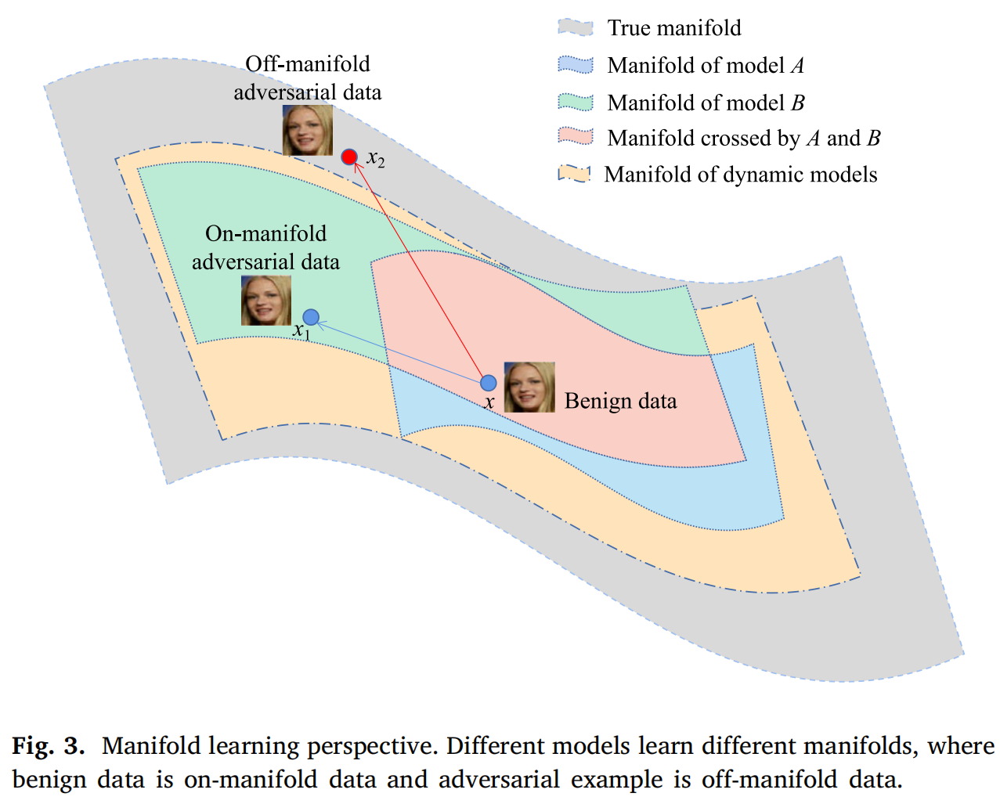

# 分层特征变换攻击：为人脸识别生成可迁移的对抗样本
<small>李政翱 · 周论文阅读 · 10th Mar</small>

## 摘要
基于深度卷积神经网络（DCNN）的人脸识别技术已取得显著成功，但 DCNN 易受对抗样本的攻击，这对人脸识别系统的安全性构成潜在威胁。 **可迁移对抗样本**可通过替代模型生成并迁移到目标模型，严重削弱 DCNN 的鲁棒性。

当前主流的**基于迁移的对抗攻击**通常依赖静态替代模型生成可迁移对抗样本，导致其**对替代模型过拟合**，进而降低迁移性。为此，我们提出了一种新型基于迁移的黑盒攻击方法——分层特征变换攻击（HFTA），通过随机破坏替代网络中的单元构建动态替代模型，有效缓解对抗样本对替代模型的过拟合风险。同时，该方法隐式集成了分层特征变换机制以增强对抗样本的迁移性。**HFTA 可灵活与任意基于梯度的可迁移攻击方法结合**。

在多样化人脸数据集 LFW 和属性丰富的人脸数据集 CelebA 上的实验表明，**HFTA 显著提升了对抗样本的迁移性**，攻击成功率平均提升超过 10%。此外，相较于其他方法，HFTA 对其他攻击方法成功率的增幅最高达 62.8%，验证了其在增强替代模型动态性与隐式集成方面的有效性。此外，HFTA 生成的对抗人脸在特征相似度上更低、图像质量更高。

## 人脸识别领域的对抗样本

    

如图 1 所示，攻击者对人脸图像进行轻微的干扰，从而形成一个被人脸识别系统识别为不同个体的对抗样本。

## 对抗攻击：MIM

**Momentum Iterative Fast Gradient Sign Method (MIM / MI-FGSM，动量迭代快速梯度符号法)** 是基于 FGSM 的一种对抗攻击方法，其主要思想是通过引入动量来避免局部最小值。基于动量的迭代公式如下：
$$
g_{t+1}=\mu \cdot g_t + \frac{\nabla_x J(x, y)}{\Vert \nabla_x J(x, y) \Vert_1}
$$

$$
x_{t+1}^{adv}=Clip_x^\epsilon\{x_t^{adv} + \alpha \cdot sign(g_{t+1}) \}
$$
其中梯度 $g_t$ 的计算变为了将之前所有迭代的梯度相加，并乘以衰减因子 $\mu$ 后再与当前梯度相加。

## 对抗攻击：TIM

**Translation-Invariant Method (TIM，变换不变性方法)** 则使用从多个**平移图像**中计算出的梯度的平均值代替良性图像的梯度。受**平移不变性质**的启发，他们通过将梯度与预定义的核矩阵进行卷积来近似这个过程，以减小计算复杂度。

$$
T(\nabla_x J(x, y)) = W\star\nabla_x J(x, y)
$$

其中 $W$ 是形状为 $(2k+1)\times(2k+1)$ 的核矩阵，$\star$ 表示卷积操作。

> **平移不变性**
> 
> 此处的平移不变性是指人脸识别模型在图像中人脸的位置发生平移时，模型的输出不变。相对地，人脸检测模型则具有平移等变性，即图像中人脸平移时，其输出的人脸位置坐标也发生平移。

## 对抗攻击：DIM

**Diverse Input Method (DIM，多样输入方法)** 则是一种数据增强方法，通过随机调整图像大小并填充来防止对替代模型的过拟合，从而增强对抗样本的鲁棒性。其形式化表示为：

$$
D(x, p) = \left\{
\begin{aligned}
&random\ resize\ x &with\ &p   \\
&x               &with\ &1-p 
\end{aligned}
\right.
$$

DIM 以概率 $p$ 将图像调整为 $r \times r \times 3$ 图像，然后将其填充到指定的大小。

## HFTA 与上述攻击方法的集成

上述的攻击方法主要聚焦于以下方面：
- **梯度优化**（Gradient Optimization）
- **输入变换**（Input Transformation）
- **模型集成**（Model Ensemble）

以此来防止对抗样本对替代模型过拟合，从而影响迁移性。HFTA **与以上方法都能够有效集成**，因为其通过不更改模型结构的方法对不同层的特征进行变换。

## HFTA 算法

如左图所示，HFTA 算法主要可分为以下步骤：

1. **创建动态模型**
对于每次迭代，都创建一个动态模型 $F_t(\cdot)$，其在模型的第 $i$ 层特征中添加高斯噪声。

1. **计算损失函数**
通过计算对抗样本与原样本在动态模型 $F_t(\cdot)$ 下的欧氏距离作为损失函数来优化对抗样本。

1. **由现有对抗攻击生成梯度**
通过现有的基于梯度的攻击方法计算梯度。

1. **更新对抗样本**
使用计算出的梯度更新对抗样本。

## HFTA 图例

    

如上图所示，HFTA 在模型的某些层的特征中添加高斯噪声 $G \sim \mathcal{N}(\mu, \sigma^2)$ 。

## 数据流形解释

真实世界的数据通常分布在一个流形上，训练 DNN 需要学习一个特征流形来拟合这种分布。然而，由于嵌入空间的高维性，该模型难以推广到未采样数据，导致学习流形与实流形不匹配。

对抗样本具有一定的语义信息，可以视为未采样的数据。它们不是分布在流形上，而是分布在流形的邻域上。不同的模型学习了不同的流形。由模型 $\mathcal A$ 生成的对抗样本 $x_1$ 是 $\mathcal A$ **流形外样本**，但仍是 $\mathcal B$ **流形上**的样本。因此，$\mathcal B$ 可以正确地识别它。

HFTA 增加了替代模型的多样性，并在迭代步骤中隐式地集成了分层特征转换来形成动态模型。因此，**动态模型的流形更接近于真实的流形**。HFTA 生成的对抗样本 $x_2$ 是动态模型和 $\mathcal B$ 的**流形外样本**，导致 $\mathcal B$ 错误识别 $x_2$ 。

## 实验数据

    

如上图所示，使用 HTFA 集成后的**攻击成功率**（ASR）显著上升。

## 总结

深度人脸识别模型已在各种实际应用场景中得到了广泛的应用。确保深度人脸识别模型的安全性对于探索识别系统的对抗性鲁棒性和泛化已经变得越来越重要。本文对人脸识别系统的**基于转移的对抗攻击**领域进行了深入研究，并提出了一种新的**黑盒对抗攻击方法**——**层次特征变换攻击（HFTA）**。值得注意的是，HFTA **与基于梯度的对抗攻击无缝集成**，有效地提高了它们的性能。

在两个基准数据集上进行的一系列综合实验明确地证明了 HFTA 在显著提高对抗性实例的可转移性方面的优越性。定性和定量分析都强调，与那些由最先进的基于转移的方法生成的对抗样本相比，**由 HFTA 生成的对抗样本表现出更低的余弦相似度和更高的 SSIM**。

在未来的研究中，我们旨在探索替代的特征转换方法，并进一步研究 HFTA 对深度人脸识别模型的对抗性鲁棒性的影响。

## 心得

此篇论文的**方法不复杂，但其思路独特**。在其他攻击方法聚焦于如何提高梯度的鲁棒性、替代模型的普适性时，其选择**动态生成**替代模型，从而表现出了对以上静态方法的优越性。当然，其选择了通过添加高斯噪声来动态生成替代模型，而此方法应该可以继续改进。

除了论文中给出的数学证明外，其还从**数据流形**的方面给出了解释。通过扩大替代模型的数据流形来使其更加贴合现实分布，来使得对抗攻击迁移性更好。在以后的学习中，也可以从此角度出发分析鲁棒性。